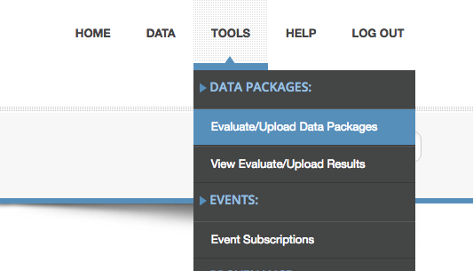
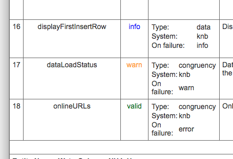
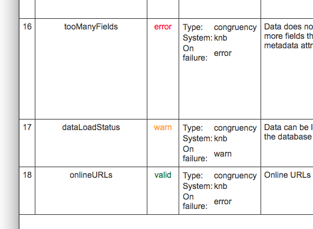

## How to use the EML Congruence checker
### Output
An XML document contains the output. Using XML allows output can be transformed for a variety of purposes, e.g., an individual report can be transformed into HTML for web presentation during evaluation of a single data package, or results from a group of reports can be aggregated and statistics computed. 

### Modes
- Evaluate: An EML document can be evaluated by the Quality Engine without adding it to the repository. Typically, software for evaluating XML stops at the first error and repeated submissions are required until all errors have been exposed. In the ECC however, at much as possible, all errors be exposed in one run (rather than stopping processing) so that a submitter sees as many problems as possible at once. This feature saves a considerable time. Of course, some errors will prevent future
processing, e.g., if a data-URL does not return a data entity, that entity cannot be examined. Reports from Evaluation mode are
stored for 180 days only.
- Upload: When an EML document is uploaded for the purpose of being added to the repository, the Quality Engine halts on the first error, saving processor time. Upon a successful upload, the quality report document is stored permanently as part of the data package (associated via the resource map), and can be accessed and displayed alongside its metadata and data. 

### Log in
You must be logged into either an EDI or LTER account to access this tool. Log in from the "Tools" menu, either 
- Evaluate/Upload packages or
- View Evaluate/Upload results

### Report interpretation
With very few users and with responses that are somewhat arcane, it is simpler for us to go over your report with you. Do not hesitate to ask for help (info@environmentaldatainitiative.org). 
Generally, the columns to the left are what the checker expects, and the right columns are what the checker found. 

Sample reports:
- All fields valid (upload mode). See the column labeled "Status". Checks returning "Valid" will be green; Checks returning "info" are blue.
  - https://portal.edirepository.org/nis/reportviewer?packageid=edi.140.1
- Report showing warns (upload mode). See the column labeled "Status". Checks returning "warn" will be orange.
  - https://portal.lternet.edu/nis/reportviewer?packageid=knb-lter-sbc.117.1
  
  
  
- Report showing errors (eval mode; link will expire in ~Sept 2018)  Checks returning "error" will be red.
  - https://portal.lternet.edu/nis/reportviewer?packageid=knb-lter-sbc.117.1&localPath=%2Fhome%2Fpasta%2Flocal%2Fharvester%2FSBC-evaluate-2018-03-19-1521501458684%2Fknb-lter-sbc.117.1%2FqualityReport.xml

  
